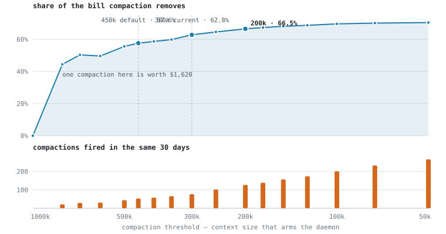

# claude-code-auto-compactor

Drive a running Claude Code session from an external process, using the VS Code extension's own
launch hook — plus an idle auto-compactor built on it.

- **`shim/cc-stdin-shim`** gives every VS Code Claude Code session a side channel at
  `/tmp/cc-inject/<pid>.sock`. Write a line into it and the session behaves as if you had typed
  that line into the composer, slash commands included.
- **`compactd.py`** is the reference consumer: it sends `/compact` to sessions that went idle
  holding a large context, while the prompt cache is very likely still warm.

Ignore `compactd.py` if you only want the channel. macOS + VS Code only.

## Why this saves anything

Claude re-reads the whole conversation every time you send a message. To stop that costing a
fortune it is kept as a **warm copy** — reading from it costs about a twentieth of what building
it costs. The warm copy is discarded after an hour of silence, and the next message rebuilds one
at full price, for however large the conversation has grown.

Compaction swaps the conversation for a summary, about a fifth of the size in practice. The whole
question is *when*:

```
  last turn                                                       cache expires
      │                                                          │
      ├───────────────── warm copy alive (1 h) ──────────────────┤─────────►
      │                                ▲                         │
      │                        ┌───────┴────────┐                │
      │                        │  compact here  │                │
      │                        │  50 - 58 min   │                │
      │                        └────────────────┘                │
      │                                                          │
      │  the summary reads the warm copy, so writing             │  the summary must
      │  it is nearly free -- and the new warm copy              │  rebuild everything
      │  it leaves behind is small                               │  first: full price
```

Avoiding that one cold rebuild is the obvious win, and it is **not the big one**. The bigger term
is the read tax: after compaction *every* later turn reads a fifth as much, and that accrues per
turn for the rest of the session. On the workload measured below, cache reads alone were **52% of the
bill**, against 37% for cache writes and 10% for output — so the term that scales with how big
you let a context get is also the term that dominates.

## What it's worth

Replaying 1,179 local sessions turn by turn — 302,213 assistant turns over 30 days — and
re-deciding at each idle window whether to compact:

<picture>
  <source media="(prefers-color-scheme: dark)" srcset="charts/savings-curve-dark.svg">
  
</picture>

| threshold | compactions / 30d | share of bill removed | marginal, per compaction |
|---|---:|---:|---:|
| 800k | 21 | 44.4% | $1,620 |
| 500k | 44 | 55.6% | $354 |
| 450k *(default)* | 53 | 57.6% | $166 |
| 300k | 77 | 62.8% | $204 |
| 200k | 127 | 66.5% | $58 |
| 100k | 201 | 69.6% | $25 |
| 50k | 266 | 70.4% | $6 |

Two things to take from the curve. **Almost all of the money is in the first third of the
descent** — going from no compaction to a 500k threshold captures 56 points with 44 compactions;
grinding from 500k down to 50k adds 15 more and costs six times the interruptions. (The dip at
600k in the figure is ordering noise, not a feature: compacting earlier changes which later
windows still qualify, and at high thresholds there are too few events to average it out.) And **the
marginal value per compaction collapses**, from $1,620 at 800k to under $60 below 200k, because
you start compacting sessions that were never going to be expensive.

The curve is that steep because spend is wildly concentrated: of 412 billable sessions, the top 5
were **51% of the total** and the top 25 were 82%. The single most expensive session — 38,627
turns — was a third of the month's bill on its own. High thresholds hit exactly those; low
thresholds work the tail, and the tail is nearly free.

If you only take one number: **anything above a 450k threshold is leaving real money on the
table, and anything below 200k is buying single-digit dollars with a real interruption.**

## When it fires

Fire when idle is in **`[50 min, 58 min)`** and context is **≥ 450k**. The lower bound gets as
close to cache expiry as polling allows; the upper bound refuses the bet once the cache is
probably already gone.

<picture>
  <source media="(prefers-color-scheme: dark)" srcset="charts/idle-gaps-dark.svg">
  
</picture>

Every gap left of the marker resumes onto a live cache and rebuilds almost nothing. Right of it,
the cache is certainly gone and the resuming turn pays ~320k tokens of cold rebuild — **21% of
all idle gaps land there.** That is the population this daemon is aiming at.

Two more numbers set the odds. A session that reaches 50 minutes idle comes back **50%** of the
time (1,197 did, 1,213 never did). Of the ones that come back, **89% come back after the hour is
up** — so when the bet pays, it nearly always pays the full cold rebuild, and when it loses, it
loses only the price of reading a warm cache once (about $0.27 at a 300k context).

The window assumes a 1-hour cache tier. **Check yours** — a 5-minute tier needs a much tighter
one:

```sh
grep -ho '"ephemeral_[0-9]*[hm]_input_tokens":[0-9]*' ~/.claude/projects/*/*.jsonl \
  | awk -F'[:"]' '{t[$2]+=$NF} END{for(k in t) print k, t[k]}'
```

Compaction also costs conversation detail, which is the other reason the floor is not lower —
below 200k the money no longer argues for it and the lost detail still does.

## Install

```sh
git clone https://github.com/dthinkr/claude-code-auto-compactor
cd claude-code-auto-compactor
./install.sh                 # --shim-only to skip the daemon;  ./uninstall.sh to undo
```

It backs up and edits your VS Code user settings, writes a launchd plist, and loads it.
**Sessions already running keep their old process** — restart one, then `./compactd.py --status`
should show `yes` in the port column.

All three bounds are environment variables, which is also how you exercise the whole path without
waiting an hour:

| variable | default | what it does |
|---|---|---|
| `CC_COMPACT_CTX` | `450000` | context floor that arms the daemon |
| `CC_COMPACT_IDLE_MIN` | `3000` (50 min) | earliest it will fire |
| `CC_COMPACT_IDLE_MAX` | `3480` (58 min) | past this, the bet is declined |
| `CC_INJECT_ALLOW` | unset | restrict the channel to one exact command |

To change them for the installed agent, add an `EnvironmentVariables` dict to
`~/Library/LaunchAgents/com.claude-auto-compact.plist` and reload it — that keeps your tuning out
of the code:

```xml
<key>EnvironmentVariables</key>
<dict>
  <key>CC_COMPACT_CTX</key><string>300000</string>
</dict>
```

```sh
compactd.py --status      # per-session verdict; first line is the daemon heartbeat
compactd.py --dry-run     # decide and log, send nothing
tail -f ~/.local/state/claude-auto-compact/compactd.log
```

The daemon is silent unless it acts, so the heartbeat is how you tell "running, nothing due" from
"not running".

## How it works

Claude Code wraps or de-slashes every input path that is not a human typing — `Stop` hook `block`
reasons, the cross-session peer socket, Remote Control events — so none of them can invoke a slash
command. The session's own stdin is the exception: the extension runs the CLI with
`--input-format stream-json` over a socketpair, and a message arriving there has no `origin`
field, which Claude Code reads as human. The extension's documented
`claudeCode.claudeProcessWrapper` setting is enough to get a handle on that stdin; the shim execs
the real binary unchanged and multiplexes one socket into it. stdout/stderr are inherited
untouched.

[FINDINGS.md](FINDINGS.md) has the full record: the eight injection routes that *don't* work,
`autoCompactWindow` and cache-tier semantics, the replay method behind the curve above and its
three known biases, and measurement mistakes worth not repeating.

## How the numbers were measured

`replay.py` produces the curve and the table above; run it on your own transcripts before
trusting either. It reads `~/.claude/projects/**/*.jsonl` and takes per-turn
`input_tokens` / `cache_read_input_tokens` / `cache_creation_input_tokens` / `output_tokens`
straight from the transcripts — no estimation. `analyze_sessions.py` answers the narrower per-event question, and `charts/make_charts.py`
redraws the figures.

Costs are Anthropic first-party list prices, cache writes billed at the 1-hour tier (2× input);
free and gateway-routed models are excluded from dollar figures. The compaction ratio is the
measured `C′/C = 0.203` across 142 real compactions.

**This is one person's workload on one machine.** The shape of the curve should generalize — it
comes from spend concentration, which is a property of how agentic sessions grow — but the
thresholds are worth re-deriving on your own transcripts before trusting them. Three known biases,
all small and all in the same direction: the replay only fires at windows where the session
actually resumed, so it omits compactions wasted on sessions that never came back (~0.1% of the
total); the summary is modelled at a flat 0.2× rather than per-session; and the baseline is real
30-day spend that already contains a few days of the daemon running.

## Caveats

- **The channel accepts arbitrary text**, not just `/compact` — anything running as your user can
  type into your sessions. Not a privilege boundary (whoever can edit your VS Code settings can
  already run code as you), but set `CC_INJECT_ALLOW='/compact'` to make it single-purpose.
- **`claudeProcessWrapper` is documented; missing-origin-as-human is not.** That part is internal
  behaviour and could change in any release.
- **Upgrades are fine.** The setting lives in user settings, and the real binary path is whatever
  the extension passes as `argv[1]`. If that convention ever changes the shim finds a bundled
  binary itself and runs it, losing only the side channel — it never leaves you unable to start a
  session.
- **Terminal sessions are not covered.** They never go through the extension, and their input is a
  tty; `TIOCSTI` returns `EPERM` on current macOS.

Related: [cache-keepalive](https://github.com/yujiachen-y/claude-code-cache-keepalive) and
[CacheWarden](https://github.com/Efs-O/CacheWarden) take the opposite approach — keep the cache
warm rather than shrink the context — and both hardcode the 5-minute tier. Upstream request:
[anthropics/claude-code#66115](https://github.com/anthropics/claude-code/issues/66115).

## License

MIT.
