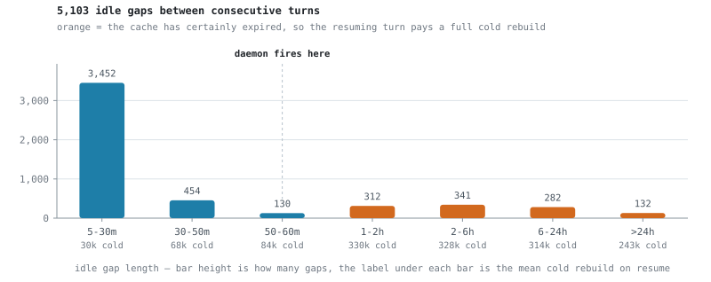
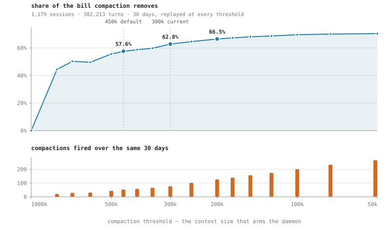

# I left a big session open overnight and the first message next morning cost a fortune

`auto-compact` sends `/compact` to an idle Claude Code session while its prompt cache is still
warm. The summary is then written against a cache you have already paid for, and every turn after
it reads about a fifth as much.

It is two pieces, and you can take only the first.

- **`shim/cc-stdin-shim`** gives every VS Code Claude Code session a side channel at
  `/tmp/cc-inject/<pid>.sock`. Write a line into that socket and the session behaves as if you had
  typed the line into the composer and pressed enter. Slash commands included.
- **`compactd.py`** is the consumer. A launchd agent runs it every 120 seconds. It sends
  `/compact` to sessions that went idle holding a large context.

Ignore `compactd.py` if you only want the channel. Install it with `--shim-only`.

macOS and VS Code only. Terminal sessions never go through the extension, so they are not covered.

---

## Why the timing is the whole problem

Claude re-reads the entire conversation on every message. Anthropic keeps a warm copy so you do not
pay to rebuild it each turn, and reading that copy costs about a twentieth of what writing it
costs. The warm copy is discarded after the cache TTL, and the next message rebuilds one at full
price, at whatever size the conversation has reached.

Compaction swaps the conversation for a summary, measured at about a fifth of the size. The
question is when to do it.

```
  last turn                                                      cache expires
      │                                                          │
      ├───────────────── warm copy alive (1 h) ──────────────────┤────────►
      │                                ▲                         │
      │                        ┌───────┴────────┐                │
      │                        │  compact here  │                │
      │                        │  50 to 58 min  │                │
      │                        └────────────────┘                │
      │                                                          │
      │  the summary reads the warm copy, so writing it          │  the summary
      │  is nearly free, and the warm copy it leaves             │  first rebuilds
      │  behind is small                                         │  the whole
      │                                                          │  context at
      │                                                          │  full price
```

Skipping one cold rebuild is the obvious win. It is the smaller one. The larger term is the read
tax: after compaction every later turn reads a fifth as much, and that accrues for the rest of the
session. On the workload measured below, cache reads were 52% of the bill, against 37% for cache
writes and 10% for output. The term that scales with how large you let a context grow is also the
term that dominates.

---

## When it fires

Fire when idle time is in `[50 min, 58 min)` and context is at or above 450k tokens.

The lower bound gets as close to cache expiry as 2-minute polling allows. The upper bound refuses
the bet once the cache is probably already gone, because compacting cold means paying the full
rebuild for the summary and then paying again for the summary's own cache write.

Idle is measured from the completion of the last API request, not from the transcript's mtime.
`queue-operation`, `bridge-session` and `last-prompt` entries touch the file without any API call,
so mtime can report "active" for a session whose cache is old.

<picture>
  <source media="(prefers-color-scheme: dark)" srcset="charts/idle-gaps-dark.svg">
  
</picture>

Every gap left of the marker resumes onto a live cache and rebuilds almost nothing. Right of it the
cache is gone and the resuming turn pays roughly 320k tokens of cold rebuild. 21% of all idle gaps
land there, and that is the population this daemon aims at.

Two numbers set the odds. A session that reaches 50 minutes idle comes back 50% of the time (1,197
did, 1,213 never did). Of the ones that come back, 89% come back after the hour is up. When the bet
pays it nearly always pays the full cold rebuild, and when it loses it costs one warm read, about
$0.27 at a 300k context on first-party list prices.

### Check your cache tier before you trust that window

The window assumes a 1-hour cache tier. A 5-minute tier needs a much tighter one, and the shipped
defaults would be wrong by an order of magnitude.

```sh
grep -ho '"ephemeral_[0-9]*[hm]_input_tokens":[0-9]*' ~/.claude/projects/*/*.jsonl \
  | awk -F'[:"]' '{t[$2]+=$NF} END{for(k in t) print k, t[k]}'
```

On the machine this was written on, that prints 3,138,261,040 against `ephemeral_1h` and 613,444
against `ephemeral_5m`, so the 1-hour tier is real here. That is also why it cannot be assumed for
anyone else. `install.sh` runs this check and refuses if the 5-minute tier dominates. It will tell
you to pass `--shim-only` or lower the bounds yourself.

The tier is a property of your account and it can change. There is a string in the binary reading
`overage state changed (TTL flip expected)`, so entering usage overage flips it. Which tier it
flips to is not stated.

---

## How much this is worth, on one machine

**Everything in this section is one person's workload on one machine over 30 days.** The dollar
figures are that person's bill and yours will differ. The shape of the curve comes from spend
concentration, which is a property of how agentic sessions grow, so it should generalize. The
thresholds are worth re-deriving on your own transcripts. `replay.py` does that, and it reads only
your own files.

Replaying 1,179 local sessions turn by turn (302,213 assistant turns) and re-deciding at each idle
window whether to compact:

<picture>
  <source media="(prefers-color-scheme: dark)" srcset="charts/savings-curve-dark.svg">
  
</picture>

| threshold | compactions / 30d | share of bill removed | marginal, per compaction |
|---|---:|---:|---:|
| 800k | 21 | 44.4% | $1,620 |
| 500k | 44 | 55.6% | $354 |
| 450k *(shipped default)* | 53 | 57.6% | $166 |
| 300k | 77 | 62.8% | $204 |
| 200k | 127 | 66.5% | $58 |
| 100k | 201 | 69.6% | $25 |
| 50k | 266 | 70.4% | $6 |

The curve says two things.

Almost all of the money is in the first third of the descent. Going from no compaction to a 500k
threshold captures 56 points with 44 compactions. Grinding from 500k down to 50k adds 15 more
points and costs six times the interruptions.

Marginal value per compaction falls hard, from $1,620 at 800k to $6 at 50k, because below the
middle of the range you start compacting sessions that were never going to be expensive. The fall
is not monotonic: 300k comes in at $204 against $166 at 450k. That bump is the same ordering
effect described below and not a reason to prefer 300k.

The dip at 600k in the figure is ordering noise and not a feature. Compacting earlier changes which
later windows still clear the threshold, and at high thresholds there are too few events for that
effect to average out.

The curve is steep because spend is concentrated. Of 412 billable sessions the top 5 were 51% of
the total and the top 25 were 82%. The single most expensive session, 38,627 turns, was a third of
the month's bill on its own. High thresholds hit exactly those sessions. Low thresholds work the
tail, and the tail is nearly free.

If you take one number from this: above a 450k threshold you are leaving real money on the table,
and below 200k you are buying single-digit dollars with a real interruption.

Compaction also costs conversation detail. That is the other reason the floor is not lower. Below
200k the money no longer argues for it and the lost detail still argues against it.

### Three known biases

All three are small and all three point the same way, making compaction look slightly better than
it is.

1. The replay only fires at windows the session actually resumed from, so compactions wasted on
   sessions that never came back are not billed. Measured at about 0.1% of the total at a 300k
   threshold.
2. The summary is modeled at a flat `C'/C = 0.203`, the measured ratio across 142 real compactions,
   rather than per session.
3. The baseline is real 30-day spend from a window in which the daemon was already running for part
   of the time, so it is not a clean no-compaction counterfactual.

Costs are Anthropic first-party list prices with cache writes billed at the 1-hour tier (2x input).
Models that are free or routed through a gateway are excluded from dollar figures rather than
guessed at.

---

## Install

Everything here runs out of this checkout, so clone the repo somewhere you will not move it: the VS
Code setting and the launchd plist both point at absolute paths inside the clone, and moving or
deleting it breaks both.

```sh
./cc-kit install auto-compact              # shim and daemon
./cc-kit install auto-compact --shim-only  # side channel only, no daemon
```

The second form is the same as running `tools/auto-compact/install.sh --shim-only` directly.

The installer sets one VS Code user setting, `claudeCode.claudeProcessWrapper`, pointing at
`tools/auto-compact/shim/cc-stdin-shim` in this checkout. It backs the settings file up first. If
your `settings.json` has comments in it, JSON parsing fails and the installer prints the key for
you to add by hand rather than rewriting the file.

**Sessions already running keep their old process.** Restart one before you check anything.

```sh
./cc-kit status auto-compact          # one line: agent, last run, effect in place
tools/auto-compact/compactd.py --status   # per-session verdict, one row per live session
```

`--status` prints a `port` column. `yes` means that session has picked up the shim. `no` means it
started before the shim was installed, and restarting it is the fix. The first line of `--status`
is the daemon's heartbeat, which is how you tell "running, nothing due" from "not running". The
daemon is silent unless it acts.

```sh
tools/auto-compact/compactd.py --dry-run       # decide and log, send nothing
tail -f ~/.local/state/ccw/auto-compact/compactd.log
```

---

## Tuning

**The daemon reads these. Set them in the plist.**

| variable | default | effect |
|---|---|---|
| `CC_COMPACT_CTX` | `450000` | context floor that arms the idle rule |
| `CC_COMPACT_IDLE_MIN` | `3000` (50 min) | earliest it will fire |
| `CC_COMPACT_IDLE_MAX` | `3480` (58 min) | past this the bet is declined |
| `CC_COMPACT_CEILINGS` | empty | Comma separated `prefix=tokens` pairs. A separate rule, see below |

Overriding the two idle bounds is also how you exercise the whole path without waiting an hour.

Add an `EnvironmentVariables` dict to
`~/Library/LaunchAgents/io.github.dthinkr.ccw.auto-compact.plist` and reload the agent. That keeps
your tuning out of the code and survives a `git pull`.

```xml
<key>EnvironmentVariables</key>
<dict>
  <key>CC_COMPACT_CTX</key><string>300000</string>
</dict>
```

```sh
launchctl bootout gui/$(id -u)/io.github.dthinkr.ccw.auto-compact
launchctl bootstrap gui/$(id -u) ~/Library/LaunchAgents/io.github.dthinkr.ccw.auto-compact.plist
```

**The shim reads these, and the shim never sees the plist.** VS Code launches it, so its
environment is VS Code's environment. Set these where VS Code will see them (`launchctl setenv`, or
your login shell if you start VS Code from a terminal) and restart VS Code.

| variable | default | effect |
|---|---|---|
| `CC_INJECT_ALLOW` | unset | comma separated list of accepted lines. Set it to `/compact` to make the channel single purpose |
| `CC_INJECT_DIR` | `/tmp/cc-inject` | directory holding the sockets |

The daemon reads `CC_INJECT_DIR` as well. If you change it, change it in both places, or the daemon
looks in the wrong directory and reports every session as having no shim.

---

## The second rule: model context ceilings

The idle rule above is a money rule, and it waits, because compacting against a warm cache is what
makes it cheap. There is a second rule in the same daemon that does not wait.

When a session's context passes the usable window of the model it is running on, the next request
fails upstream and there is nothing left to optimize. A session being used hard never reaches 50
minutes idle, and it is exactly the kind of session that runs into a ceiling.

`MODEL_CEILINGS` ships empty, so this rule does nothing unless you fill it. It is for people who
reach non-Anthropic models through a gateway and know those models' usable windows.

```
CC_COMPACT_CEILINGS='<model-id-prefix>=400000,<other-prefix>=250000'
```

Set it in the same `EnvironmentVariables` dict as the thresholds, not in your shell, or the daemon
will not see it. A malformed or non-numeric entry is skipped with a line on stderr rather than
taking the daemon down. (Angle brackets are placeholders here. Inside a plist `<string>` they would
have to be written `&lt;` and `&gt;`, and a real model prefix has none.)

Matching is by longest prefix, so one entry covers a whole family and pool ids that carry a build
suffix still match. The numbers are trigger points and not the model's hard limit. Leave headroom
for the growth between two scans, which are 120 seconds apart.

The two rules share one armed flag per session, so a session never receives two `/compact` messages
in the same pass. After a compaction the session re-arms when its context falls back below
`CC_COMPACT_CTX`.

---

## How it works

Claude Code wraps or de-slashes every input path that is not a human typing. `Stop` hook `block`
reasons, the cross-session peer socket, Remote Control events: none of them can invoke a slash
command. See [notes.md](notes.md) for the eight routes that were tried and failed.

The session's own stdin is the exception. The extension runs the CLI with
`--input-format stream-json` over a socketpair, and a message arriving there has no `origin` field.
Claude Code reads a missing origin as human, so the content reaches the slash gate untouched and
`/compact` expands.

Getting a handle on that stdin uses a documented setting. `claudeCode.claudeProcessWrapper` is
described in the extension's `package.json` as "Executable path used to launch the Claude process".
With it set, the extension invokes

```
<wrapper> <real binary> <all the normal args...>
```

so the real binary arrives as `argv[1]`. The shim execs it unchanged and does exactly one extra
thing: it feeds the child's stdin from both its own stdin and a unix socket. stdout and stderr are
inherited untouched, so the extension's protocol never sees the shim.

The socket is opened only when `--input-format stream-json` is present, so a terminal-mode launch
passes straight through. Its path is `/tmp/cc-inject/<child pid>.sock`, and that pid is the same
one recorded in `~/.claude/sessions/<pid>.json`, which is how the daemon maps a session name to a
socket.

One conversation can be resumed in two windows at once, giving two live pids sharing one
`sessionId` and one transcript. The daemon deduplicates by `sessionId` and sends to one of them,
preferring the one with a socket. Sending to both would pay for two summaries of the same thing.

---

## What breaks

The missing-`origin` rule is internal behavior and is not documented anywhere. If it changes, the
most likely outcome is that `/compact` arrives in your session as literal text. You would see it in
the transcript.

The `claudeProcessWrapper` setting itself is documented, and the shim does not care what the real
binary's path is, so extension upgrades are fine. If the `argv[1]` convention ever changes, the
shim finds a bundled binary itself and runs that, losing the side channel and nothing else. This
code sits in the launch path of every session, so failing to start a session is the one outcome it
refuses to have.

Moving or deleting this checkout breaks both the setting and the agent. VS Code will fail to launch
a session until you remove `claudeCode.claudeProcessWrapper` from your user settings.

---

## Caveats

- **The channel accepts arbitrary text**, not only `/compact`. Anything running as your user can
  type into your sessions. This is not a privilege boundary, since whoever can edit your VS Code
  settings can already run code as you. Set `CC_INJECT_ALLOW='/compact'` to make it single purpose
  anyway.
- **A long generation eats into the margin.** Idle is anchored on the completion of the last
  request, and the cache clock runs during a generation that produces nothing new to anchor on.
  That is part of why the window stops at 58 minutes instead of 60.
- **Compaction takes minutes on a large session.** A real 842k-token session took 3m16s, and the
  transcript is completely silent while it runs. An early check at 150 seconds looked like failure
  and was not.
- **Terminal sessions are not covered.** They never go through the extension and their input is a
  tty. `TIOCSTI` returns `EPERM` on current macOS.

---

## What is in this directory

| File | What it is |
|---|---|
| `shim/cc-stdin-shim` | The side channel. The whole tool if you pass `--shim-only` |
| `compactd.py` | The daemon. Both rules, the scan, and `--status` |
| `replay.py` | Counterfactual replay that produced the curve and the table above |
| `analyze_sessions.py` | The narrower per-event question, kept because the README's first threshold came from it |
| `charts/make_charts.py` | Redraws the two figures from the replay output |
| `notes.md` | The eight routes that do not work, `autoCompactWindow`, and three mistakes worth not repeating |
| `install.sh`, `uninstall.sh`, `status.sh` | Driven by `manifest.conf` |

`replay.py` reads `~/.claude/projects/**/*.jsonl` and takes per-turn `input_tokens`,
`cache_read_input_tokens`, `cache_creation_input_tokens` and `output_tokens` straight from the
transcripts. Nothing is estimated.

```sh
python3 tools/auto-compact/replay.py                   # sweep the default ladder
python3 tools/auto-compact/replay.py 300000 200000     # only these thresholds
python3 tools/auto-compact/replay.py --days 60 --json  # wider window, machine readable
```

---

## Related work

[cache-keepalive](https://github.com/yujiachen-y/claude-code-cache-keepalive) and
[CacheWarden](https://github.com/Efs-O/CacheWarden) take the opposite approach, keeping the cache
warm rather than shrinking the context. Both hardcode the 5-minute tier.

Upstream request for a supported trigger:
[anthropics/claude-code#66115](https://github.com/anthropics/claude-code/issues/66115).
